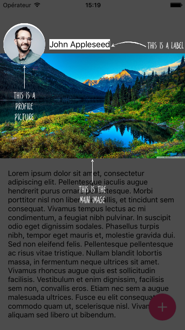
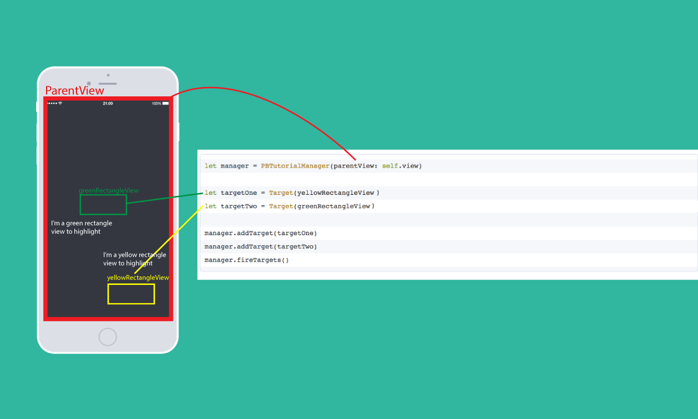
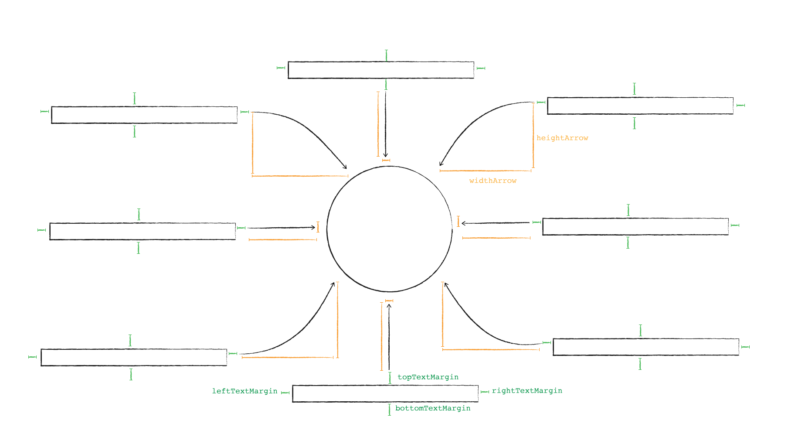

# PBTutorialManager

PBTutorialManager enables you to easily create an in-app tutorial for your app.  


  

### Version
1.0.4  
### Installation
#####  CocoaPods
 Simply add to your podfile
```ruby
pod 'PBTutorialManager'
``` 
##### Manually
Copy paste the 'lib' folder on your project
### How to use
So PBTutorialManager works with TutorialTarget's objects and manages a queue of these objects to display one after another.

  
  

```swift
let targetProfilePicture = TutorialTarget(view: profilePicture)
            .withArrow(true)
            .heightArrow(50)
            .widthArrow(25)
            .position(.bottom)
            .shape(.elipse)
            .duration(1.0)
            .message("This is a profile picture")
        
let targetMainImage = TutorialTarget(view: mainImage)
            .withArrow(true)
            .heightArrow(50)
            .widthArrow(25)
            .position(.bottom)
            .shape(.rect)
            .duration(1.0)
            .message("This is the main image")
        
let targetButton = TutorialTarget(view: button)
            .withArrow(true)
            .heightArrow(50)
            .widthArrow(25)
            .position(.top)
            .shape(.elipse)
            .message("This is a button")
            .breakPoint(true)

// Call from viewDidAppear(), before this window may be nil         
// Or you can pass the view instead of the window if toolbars
//  and navigation bars aren't being used
let tutorialManager = TutorialManager(parent: view.window!)
tutorialManager.addTarget(targetProfilePicture)
tutorialManager.addTarget(targetMainImage)
tutorialManager.addTarget(targetButton)
tutorialManager.fireTargets()
```
#### Extra target properties
Target has other properties you can play with
```swift
textAlignement 	/* The text alignement */
labelWidth      /* The width of the label */
position 		/* The position of your text around the highlight view */
arrowStartPosition /* Controlls what possition the orrow starts from, set to nill to match position behaviour */
shape 		/* The shape of the mask to highlight the view */
duration 		/* time duration before to show the next target */
font              /* A font that you can modify */
isTappable 		/* if isTappable is true you can tap to dismiss the target */
closure 		/* A closure executed after the target has been shown */
persistant		/* if persistant the target stay on screen when the next one show up, you can add multiple target one after one */
breakPoint 		/* breakpoint is a target which attempt a user click to continue */
    
/* Margins */
topMargin
rightMargin
bottomMargin
leftMargin
    
topTextMargin
rightTextMargin
bottomTextMargin
leftTextMargin
    
/* Arrow */
withArrow
heightArrow
widthArrow
arrowHeadSize
```
### Dependencies

Thanks to [AFCurvedArrowView](https://github.com/anton-filimonov/AFCurvedArrowView)

License
----
MIT License

Copyright (c) [2016] [Paul Bancarel]

Permission is hereby granted, free of charge, to any person obtaining a copy
of this software and associated documentation files (the "Software"), to deal
in the Software without restriction, including without limitation the rights
to use, copy, modify, merge, publish, distribute, sublicense, and/or sell
copies of the Software, and to permit persons to whom the Software is
furnished to do so, subject to the following conditions:

The above copyright notice and this permission notice shall be included in all
copies or substantial portions of the Software.

THE SOFTWARE IS PROVIDED "AS IS", WITHOUT WARRANTY OF ANY KIND, EXPRESS OR
IMPLIED, INCLUDING BUT NOT LIMITED TO THE WARRANTIES OF MERCHANTABILITY,
FITNESS FOR A PARTICULAR PURPOSE AND NONINFRINGEMENT. IN NO EVENT SHALL THE
AUTHORS OR COPYRIGHT HOLDERS BE LIABLE FOR ANY CLAIM, DAMAGES OR OTHER
LIABILITY, WHETHER IN AN ACTION OF CONTRACT, TORT OR OTHERWISE, ARISING FROM,
OUT OF OR IN CONNECTION WITH THE SOFTWARE OR THE USE OR OTHER DEALINGS IN THE
SOFTWARE.
